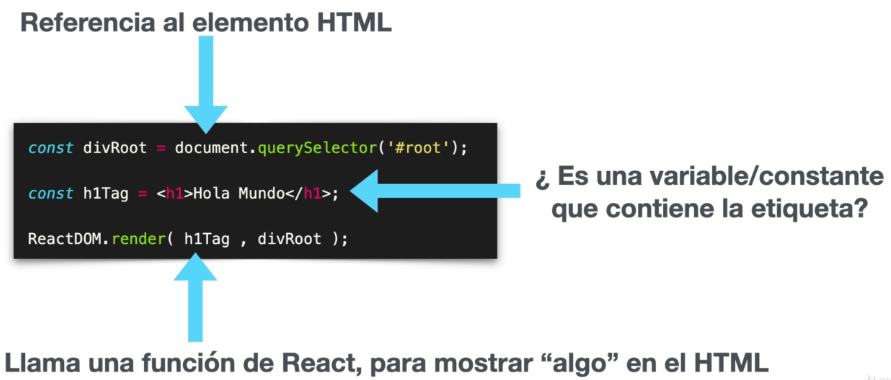

# RESUMEN CURSO REACT

#### :copyright: Resumen de Fernando Herrera [Udemy](https://www.udemy.com/course/react-cero-experto/)

###### [:page_with_curl: Todos](https://garydav.github.io/blogs-course/) mis resúmenes por [@garyDav](https://github.com/garyDav)

>:spiral_calendar: Published on October 22, 2022

---

##### Introducción

Éste es un curso de REACT de cero a experto dividido por secciones.

* Despues de cada aplicación, tendrá su sección de pruebas.

* Tendremos varios ejercicos y tareas.

#### Requisitos previos

Para seguir este tutorial en caso de trabajar con Ubuntu, necesitará lo siguiente:

* Un servidor de desarrollo con Ubuntu 20.04, un usuario no root con privilegios `sudo` y un firewall activo. Consulte esta [guía de configuración inicial para servidores](https://www.digitalocean.com/community/tutorials/initial-server-setup-with-ubuntu-20-04-es).

* Docker instalado en su servidor, siguiendo los pasos 1 y 2 de [Cómo instalar y usar Docker en Ubuntu 20.04](https://www.digitalocean.com/community/tutorials/how-to-install-and-use-docker-on-ubuntu-20-04-es).

* Docker Compose instalado en su servidor conforme el paso 1 de [Cómo instalar Docker Compose en Ubuntu 18.04](https://www.digitalocean.com/community/tutorials/how-to-install-and-use-docker-compose-on-ubuntu-20-04-es).

#### Conocimientos previos

* JasaScript Básico o Intermedio

* Manejo de la terminal Básico

---

## Sección 1

### Instalaciones necesarias y recomendadas

#### Instalaciones Necesarias

* [Google Chrome](https://www.google.com/chrome/)

* [React Developer Tools](https://chrome.google.com/webstore/detail/react-developer-tools/fmkadmapgofadopljbjfkapdkoienihi?hl=es&authuser=1)

* [Redux Devtools](https://chrome.google.com/webstore/detail/redux-devtools/lmhkpmbekcpmknklioeibfkpmmfibljd?hl=es)

* [Visual Studio Code](https://code.visualstudio.com/)

* [Postman](https://www.postman.com/downloads/)

* [Mongo Compass](https://www.mongodb.com/try/download/compass)

* [Git](https://git-scm.com/)

* [Node](https://nodejs.org/es/)

#### Extensiones de VSCode

[Activitus Bar](https://marketplace.visualstudio.com/items?itemName=Gruntfuggly.activitusbar)

#### Configuración del Bracket Pair Colorizer 2

[Bracket Pair Colorizer 2](https://marketplace.visualstudio.com/items?itemName=CoenraadS.bracket-pair-colorizer-2)

```
"bracket-pair-colorizer-2.colors": [
    "#fafafa",
    "#9F51B6",
    "#F7C244",
    "#F07850",
    "#9CDD29",
    "#C497D4"
],
```

#### Temas que estoy usando en VSCode:

* [Monokai Night](https://marketplace.visualstudio.com/items?itemName=fabiospampinato.vscode-monokai-night)

* [Tokyo Night](https://marketplace.visualstudio.com/items?itemName=enkia.tokyo-night)

* [Iconos](https://marketplace.visualstudio.com/items?itemName=PKief.material-icon-theme)

#### Instalaciones recomendadas sobre React

* [ES7 React/Redux](https://marketplace.visualstudio.com/items?itemName=dsznajder.es7-react-js-snippets)

* [Simple React Snippets](https://marketplace.visualstudio.com/items?itemName=burkeholland.simple-react-snippets)

* [Auto Close Tag](https://marketplace.visualstudio.com/items?itemName=formulahendry.auto-close-tag)

---

### Sección 2

#### ¿Qué es React?

* Es una __librería__ que nos permite a crear aplicaciones, al ser una librería tu podrías pegarla al HTML e inmediatamente empezar a trabajar con React, no es la forma tradicional de hacerlo, pero es posible.

* Al ser __Declarativa__ hace fácil seguir patrones de diseño y crear interfaces de usuario interactivas.

* Es increiblemente __Eficiente__, cuando hacemos un cambio y ese cambio impacta en el DOM o en el HTML, hay que volver a renderizarlo, únicamente hace el cambio en ese elemento.

* Trabaja de manera __Predecible__, porque toda la información fluye en una sola vía, esto nos ayuda a prevenir mutaciones involuntarias o impredecibles.

* Tenemos los __Componentes__, que son pequeñas piezas de código encapsuladas que pueden tener estado o no, y de esa manera podemos romper una aplicación que sea bastante compleja en pequeños componentes ó en pequeñas piezas sencillas y fáciles de mantener, que permita que el código sea limpio y sencillo.

> Otros puntos interesantes de React, que se puede trabajar del lado del servidor aplicaciones de React con NodeJS __Server-side con Node__. También __Aplicaciones móviles con React Native__, también aplicaciones de escritorio con __Electron__ y otras tecnologías, todo con el mismo típo de código.

#### ¿Cómo luce el código de React?

<center>


Si separamos la etiqueta __h1__ que contiene __Hola Mundo__ en una constante:



</center>

Esta mezcla de código __JavaScript__ y __HTML__ es conocido como: __JSX = JS + XML__, perfectamente podríamos escribir todo ese código sin usar esa etiqueta creandolo de la siguiente manera:

```js
const h1Tag = document.createElement('h1', null, `Hola, soy ${ nombre }`)
```

Toda esa línea de código es el equivalente a esa creación de la etiqueta directamente explícita en __JSX__

```jsx
const h1Tag = <h1>Hola Mundo</h1>
```

Esta es la mejor forma simplificada, al utilizar simples etiquetas __HTML__ en el lado de __JavaScript__.

